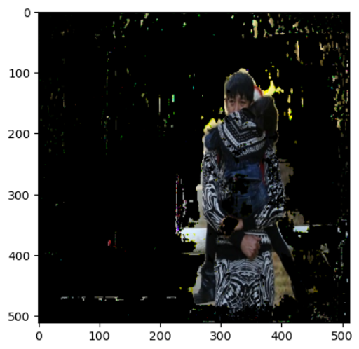
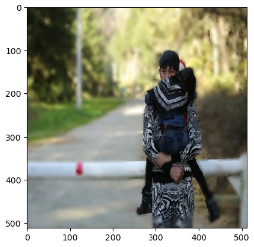

# Image Segmenter Python
This is a U-Net based model which is trained using the OCHuman Dataset for segmenting humans from the background.
It also includes code to perform segmentation on frames live from the camera
In addition to that this code also applies blur effect on the background.

## Segmentation Results
**Original Image**

**Segmented Image**

**Blured Image**

